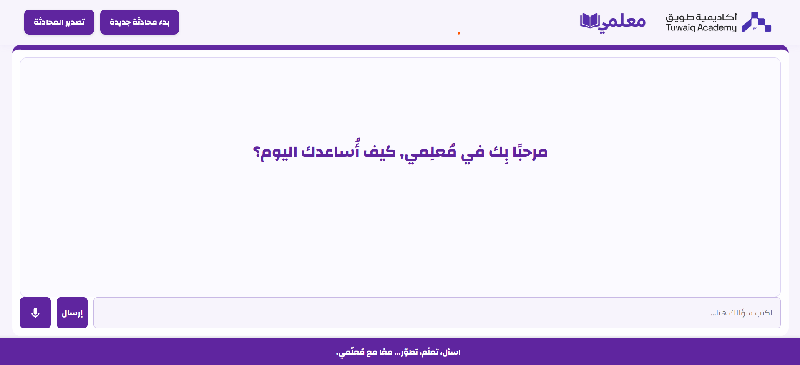

# معلمي (muallimi)

## Project Overview

**معلمي (muallimi)** is a web-based conversational application designed to assist students by acting as a virtual teacher. It leverages a Retrieval-Augmented Generation (RAG) pipeline built on LangChain, local LLM inference via Ollama, and speech-to-text / text-to-speech capabilities to provide interactive, subject-specific answers (Physics, Chemistry, Biology) in Arabic.  

A student can either type or record their question. The system automatically routes the query to the appropriate subject database, fetches relevant documents via FAISS embeddings, and generates a contextual answer with an optional audio response.

---

## Features

- **Multimodal Input**  
  - Text-based questions in Arabic  
  - Voice recording & automatic transcription using OpenAI Whisper  

- **Subject-Specific Routing**  
  - Detects keywords to route queries to Physics, Chemistry, or Biology knowledge bases  
  - Falls back to a general keyword search across all databases if no clear subject is detected  

- **Retrieval-Augmented Generation (RAG)**  
  - FAISS-based vector store for each subject  
  - HuggingFace embeddings for similarity search  
  - Ollama as the local LLM to generate answers in Arabic  

- **Text-to-Speech (TTS)**
  - Uses Microsoft Azure Cognitive Services (Arabic “Hamed” neural voice)
  - Generates an MP3 audio file for each answer

- **Speech-to-Text (STT)**
  - Uses Whisper for accurate transcription of spoken questions into text
 
- **Conversation Memory**  
  - Stores chat history and context per session  
  - Maintains conversation buffer for follow-up questions  

- **Export & Reset**  
  - “Start New Conversation” resets history  
  - “Download Conversation” exports chat as a pdf file  

- **Responsive Web UI**  
  - FastAPI + Jinja2 templates  
  - Dynamic message rendering, loader animation, and audio playback controls  
  - RTL (right-to-left) support for Arabic text  

---

## Architecture & Technologies

| Layer                 | Technology / Library                            |
|-----------------------|--------------------------------------------------|
| **Web Framework**     | FastAPI (Backend) + Uvicorn (ASGI server)        |
| **Templates & Frontend** | Jinja2 (HTML templating), Vanilla JavaScript, CSS |
| **Vector Search**     | FAISS (via `langchain-community`)                |
| **Embeddings**        | HuggingFace Embeddings (`sentence-transformers/distiluse-base-multilingual-cased-v1`) |
| **Large Language Model** | Ollama commen-r7b-arabic (local LLM inference)                    |
| **Speech-to-Text**    | OpenAI Whisper                                   |
| **Text-to-Speech**    | Azure Cognitive Services (TTS)             |
| **Audio I/O**         | `aiofiles`, JavaScript Audio API                 |
| **PDF Handling**      | PyPDF (`pypdf`), PDFKit + Pyppeteer (SSR for PDF export) |
| **Environment & Dependencies** | Python 3.10+, `venv`, `pip`                   |

---

## Installation & Setup

Follow these steps to get **معلمي** up and running on your local machine.

Create a Virtual Environment:
It is recommended to use Python 3.10:
python3.10 -m venv venv
Activate the virtual environment:
.\venv\Scripts\Activate.ps1

Install Dependencies:
Make sure pip is up-to-date, then install required packages:
pip install --upgrade pip

# Install all project dependencies
pip install -r requirements.txt

Configure Azure Cognitive TTS (Optional)
If you wish to use Azure TTS, set these environment variables:

export AZURE_API_KEY="<your_azure_subscription_key>"
export AZURE_REGION="<your_region_name>"    

Prepare FAISS Vector Stores
You should already have per-subject FAISS indices saved locally under:

/db_physics
/db_chemistry
/db_biology
If not present, run the build_db.py script to generate them:
python build_db.py

This script:
Loads raw PDF/text sources for each subject.
Splits text into documents & computes embeddings.
Builds & serializes FAISS indices into db_physics/, db_chemistry/, db_biology/.

Install & Run Ollama (Local LLM):
Ensure you have Ollama installed on your machine. Then pull the Arabic model:
ollama pull command-r7b-arabic
Finally, start the Ollama server on a free port (e.g., 11436):

# Unix/macOS:
export OLLAMA_HOST="http://127.0.0.1:11434"
ollama serve

# Windows PowerShell:
$Env:OLLAMA_HOST = "127.0.0.1:11434"
ollama serve
Ollama will listen on 127.0.0.1:11436 by default (version 0.7.0+).

Note:

If you see Error: bind: Only one usage of each socket address is normally permitted, the chosen port is already in use.
To free a port on Windows, run:
netstat -ano | findstr 11434
taskkill /PID <PID_NUMBER> /F
Then retry ollama serve.

Usage
1. Start the FastAPI Server
From the project root (with the virtual environment activated), run:
uvicorn main:app --reload
By default, the application will be available at:
http://127.0.0.1:8000/

2. Access the Web Interface
Open a web browser and navigate to:
http://127.0.0.1:8000/
You will see a greeting message (“مرحبًا بِك في مُعلِمي, كيف أُساعدك اليوم؟”) in Arabic.
You can either:
Type your question in the text box and click “إرسال”.
Click the microphone icon to record your question (automatically transcribed via Whisper).

3. Conversation Flow
First Question
The system checks for subject-specific keywords (Physics, Chemistry, Biology).
Routes the query to the corresponding FAISS index.
Retrieves top document(s), constructs RAG prompt, and queries Ollama.
Displays the answer text.
Generates an Arabic MP3 via Azure TTS or gTTS and shows a “play” button next to the answer.
Follow-up Questions
ConversationBufferMemory maintains context.
Answers build on previous messages if context is relevant.
Reset Chat
Click “بدء محادثة جديدة” to clear history and start fresh.
Download Conversation
Click “تصدير المحادثة” to download a .txt transcript of the chat.

Project Structure

muallimi/
├── db_biology/                   # FAISS index & metadata for Biology
├── db_chemistry/                 # FAISS index & metadata for Chemistry
├── db_physics/                   # FAISS index & metadata for Physics
├── static/                       # Static assets (CSS, JS, images, audio)
│   ├── css/
│   │   └── style.css             # Custom styles
│   ├── js/
│   │   └── app.js                # Frontend logic & event handlers
│   ├── audio/                    # Generated TTS audio files
│   ├── tuwaiaq-logo.png          # Logo
│   └── tuwaiaq-bg.png            # Background graphic
├── templates/
│   └── chat.html                 # Jinja2 HTML template for the chat UI
├── build_db.py                   # Script to build FAISS indices from source PDFs
├── main.py                       # FastAPI application (backend + routes)
├── requirements.txt              # Python dependencies
├── README.md                     # Project documentation (this file)
└── .gitignore

